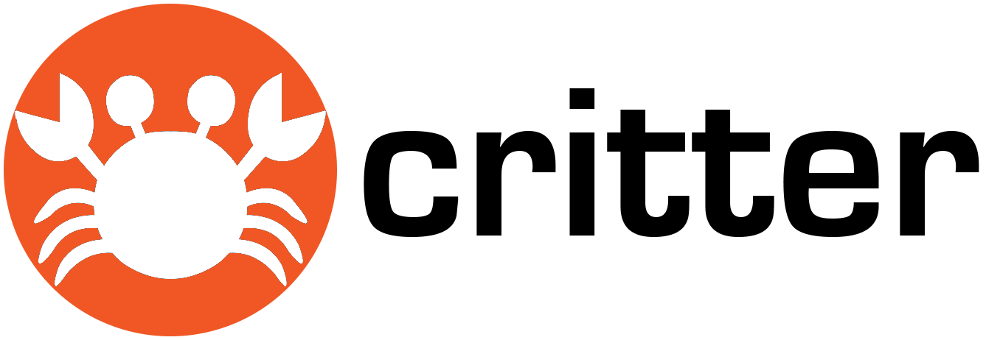

This page is a stub!
#### Overview
Critter is a warehousing data solution for benthic biodiversity data to
Based on a elaborated, but still simple enough data model, it is geared towards


It consists of three modules.
Centerpiece is the [data model](https://janhoo.github.io/critter/) and the database. The ingest tool helps you


[](https://doi.org/10.5281/zenodo.1146361)
[](https://doi.org/10.5281/zenodo.1146542)
[](https://doi.org/10.5281/zenodo.1146533)

## Getting started

### Getting started

### Prequisites

* PostgreSQL 9.x
* python3 including pyqt5, xlsxwriter, psycopg2, folium

### Installation

(steps 1+2 only if you want your own database)
1. install postgreSQL 9.x
2. then set up the database
```
cat critterbase/db.ddl.sql | psql -d <YOURDATABASENAME> -U <YOURDBUSER> -h <YOURHOSTe.g.localhost> -p <PORTe.g.5432> -q
```
You can use our database at https://www.awi.de/ourservice .

3. install python3 and the dependencies. If you are lucky, on osx and fine with homebrew,
```
./install_dependencies.sh
```
will do that for you.
Otherwise install
python3 and the packages: pyqt5 xlsxwriter psycopg2 folium

4. use **ingest** to ingest and curate data. Fire it up with

```
./start.sh
```


## Terms of use
This work is owned by Jan Holstein and partly by Paul Kloss (ingest tool)
* private use is permitted
* permission required otherwise

## Contact
* submit suggestions and bug-reports at: https://github.com/janhoo/benthos/issues
* send a pull request on: https://github.com/janhoo/benthos/
* compose a friendly e-mail to:janmholstein[at]gmail(dot)com

## Authors

* Jan Holstein - Data Model & Concept
* Paul Kloss & Jan Holstein - Ingest Tool


## HTML Documentation

https://janhoo.github.io/critter/
